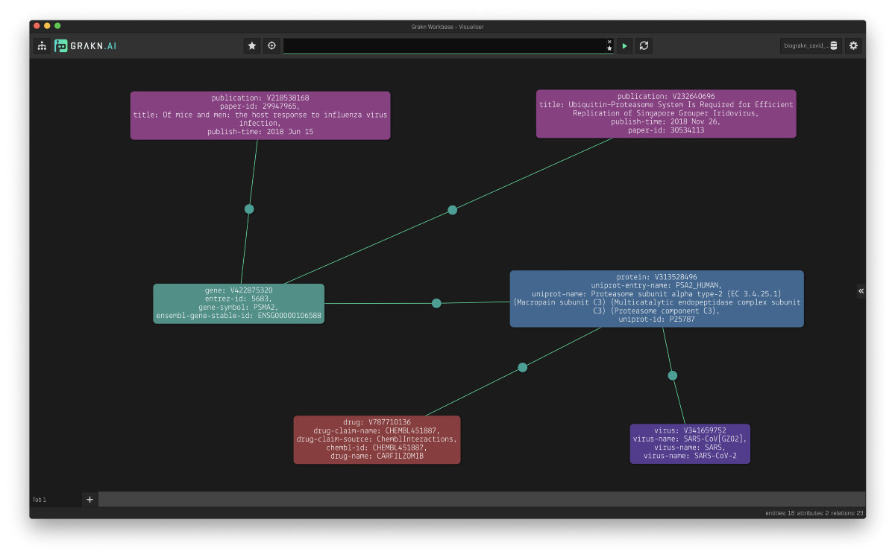
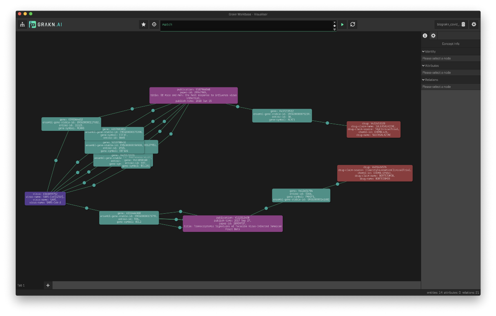

# BioGrakn Covid

**[Overview](#overview)** | **[Quickstart](#Quickstart)** | **[Installation](#installation)** | **[Datasets](#Datasets)** |
 **[Examples](#examples)** | **[How You Can Help](#How-You-Can-Help)**

[](https://discuss.grakn.ai)
[](https://stackoverflow.com/questions/tagged/grakn)
[](https://stackoverflow.com/questions/tagged/graql)

BioGrakn Covid is an open source project to build a knowledge graph to enable research in COVID-19 and related disease areas.

## Overview
We're excited to release an open source knowledge graph to speed up the research into Covid-19. Our goal is to provide a way for researchers to easily analyse and query large amounts of data and papers related to the virus.

BioGrakn Covid makes it easy to quickly trace information sources and identify articles and the information therein. This first release includes entities extracted from Covid-19 **papers,** and from additional datasets including, **proteins, genes, disease-gene associations, coronavirus proteins, protein expression, biological pathways, and drugs**.

For example, by querying for the virus *SARS-CoV-2,* we can find the associated human protein, *proteasome subunit alpha type-2* (PSMA2), a component of the proteasome, implicated in *SARS-CoV-2* replication, and its encoding gene (*PSMA2*). Additionally, we can identify the drug *carfilzomib,* a known inhibitor of the proteasome that could therefore be researched as a potential treatment for patients with Covid-19. To support the plausibility of this association and its implications, we can easily identify papers in the Covid-19 literature where this protein has been mentioned.



By examining these specific relationships and their attributes, we are directed to the data sources, including publications. This will help researchers to efficiently study the mechanisms of coronaviral infection, the immune response, and help to find targets for the development of treatments or vaccines more efficiently.

Our team currently consists of a partnership between [GSK](http://gsk.com/), [Oxford PharmaGenesis](https://www.pharmagenesis.com/) and [Grakn Labs](http://grakn.ai/)

The schema that models the underlying knowledge graph alongside the descriptive query language, Graql, makes writing complex queries an extremely straightforward and intuitive process. Furthermore, Grakn's automated reasoning, allows BioGrakn to become an intelligent database of biomedical data for the Covid research field that infers implicit knowledge based on the explicitly stored data. BioGrakn Covid can understand biological facts, infer based on new findings and enforce research constraints, all at query (run) time.

## Quickstart
BioGrakn Covid is free to access via an Azure VM. You can query it using Workbase: 
1. Download and run Workbase ([download](https://grakn.ai/download#workbase))
2. Make sure Grakn isn’t running on your local machine
3. On the main Workbase screen, change the host to the IP address shown on this page ([link](https://bit.ly/biograkn-covid)) with port *48555*
4. Click *connect,* select the keyspace *biograkn_covid* and start exploring the data!

You can also connect programmatically using one of the Grakn clients ([link](https://dev.grakn.ai/docs/client-api/overview)). Use the IP address, port and keyspace as specified above.

## Installation
**Prerequesites**: Python >3.6, [Grakn Core 1.8.0](https://grakn.ai/download#core), [Grakn Python Client API](https://dev.grakn.ai/docs/client-api/python), [Grakn Workbase 1.3.4](https://grakn.ai/download#workbase).
```bash
    cd <path/to/biograkn-covid>/
    python migrator.py
```
First, make sure to download all source datasets and put them in the `Datasets` folder. You can find the links below. Then, grab a coffee while the migrator builds the database and schema for you!

## Examples
Graql queries can be run either on grakn console, on workbase or through client APIs.  However, we encourage running the queries on Grakn Workbase to have the best visual experience. Please follow this [tutorial](https://www.youtube.com/watch?v=Y9awBeGqTes&t=197s) on how to run queries on Workbase.

```bash
# Return drugs that are associated to genes, which have been mentioned in the same 
# paper as the gene which is associated to SARS.

match 
$v isa virus, has virus-name "SARS"; 
$g isa gene; 
$1 ($g, $v) isa gene-virus-association; 
$2 ($g, $pu) isa mention; 
$3 ($pu, $g2) isa mention; 
$g2 isa gene; 
$g2 != $g; 
$4 ($g2, $dr); $dr isa drug; 
get; offset 0; limit 10;

```



## Datasets

Currently the datasets we've integrated include:
1. [CORD-19](https://www.semanticscholar.org/cord19): We incorporate the original corpus which includes peer-reviewed publications from bioRxiv, medRxiv and others.
2. [CORD-NER](https://xuanwang91.github.io/2020-03-20-cord19-ner/): The CORD-19 dataset that the White House released has been annotated and made publicly available. It uses various NER methods to recognise named entities on CORD-19 with distant or weak supervision.
3. [Uniprot](https://www.uniprot.org/uniprot/?query=proteome:UP000005640%20reviewed:yes): We’ve downloaded the reviewed human subset, and ingested genes, transcripts and protein identifiers.
4. [Coronaviruses](https://github.com/graknlabs/biograkn-covid/tree/master/Dataset/Coronaviruses): This is an annotated dataset of coronaviruses and their potential drug targets put together by Oxford PharmaGenesis based on literature review.
5. [DGIdb](http://www.dgidb.org/downloads): We’ve taken the *Interactions TSV* which includes all drug-gene interactions.
6. [Human Protein Atlas](https://www.proteinatlas.org/about/download): The *Normal Tissue Data* includes the expression profiles for proteins in human tissues.
7. [Reactome](https://reactome.org/download/current/UniProt2Reactome_All_Levels.txt): This dataset connects pathways and their participating proteins.
8. [DisGeNet](https://www.disgenet.org/downloads): We’ve taken the *curated gene-disease-associations* dataset, which contains associations from Uniprot, CGI, ClinGen, Genomics England and CTD, PsyGeNET, and Orphanet.

We plan to add many more datasets!

## **How You Can Help**

This is an on-going project and we need your help! If you want to contribute, you can help out by helping us including:

- Migrate more data sources (e.g. clinical trials, DrugBank, Excelra)
- Extend the schema by adding relevant rules
- Create a website
- Write tutorials and articles for researchers to get started

If you wish to get in touch, please talk to us on the #biograkn channel on our Discord ([link here](http://www.grakn.ai/discord)).

- Konrad Myśliwiec ([LinkedIn](https://www.linkedin.com/in/konrad-my%C5%9Bliwiec-764ba9163/))
- Kim Wager ([LinkedIn](https://www.linkedin.com/in/kimwager/))
- Tomás Sabat ([LinkedIn](https://www.linkedin.com/in/tom%C3%A1s-sabat-83265841/))